# 是时候来一波Android插件化了

---

<!-- TOC -->

- [是时候来一波Android插件化了](#是时候来一波android插件化了)
    - [前言](#前言)
    - [Android开发演进](#android开发演进)
    - [模块化介绍](#模块化介绍)
    - [插件化介绍](#插件化介绍)
    - [前提技术介绍](#前提技术介绍)
        - [APK构成](#apk构成)
            - [Manifest](#manifest)
            - [Application](#application)
            - [四大组件](#四大组件)
            - [so](#so)
            - [resource](#resource)
            - [安装路径](#安装路径)
        - [App启动流程介绍](#app启动流程介绍)
            - [IPC & Binder](#ipc--binder)
            - [AMS](#ams)
        - [插件化技术问题与解决方案](#插件化技术问题与解决方案)
            - [代码加载](#代码加载)
                - [Java ClassLoader](#java-classloader)
                - [Android ClassLoader](#android-classloader)
                    - [PathClassLoader](#pathclassloader)
                    - [DexClassLoader](#dexclassloader)
            - [资源获取](#资源获取)
            - [Hook](#hook)
    - [主流框架方案](#主流框架方案)
        - [Fragment加载](#fragment加载)
        - [Activity代理](#activity代理)
        - [Activity占坑](#activity占坑)
    - [360RePlugin介绍](#360replugin介绍)
        - [主要优势](#主要优势)
        - [集成与Demo演示](#集成与demo演示)
        - [原理介绍](#原理介绍)
            - [host lib](#host-lib)
            - [host gradle](#host-gradle)
            - [plugin lib](#plugin-lib)
            - [plugin gradle](#plugin-gradle)
    - [其他插件化方案](#其他插件化方案)
        - [Instant App](#instant-app)
        - [淘宝Atlas](#淘宝atlas)
        - [滴滴VirtualAPK](#滴滴virtualapk)
        - [Small](#small)
    - [总结](#总结)
    - [相关资料](#相关资料)

<!-- /TOC -->

## 前言

今年（2017年）6月时候，有幸参加了在北京举行的GMTC大会，恰巧360的张炅轩大神分享了360的插件化方案—— [RePlugin](https://github.com/Qihoo360/RePlugin) ，听了以后，受益匪浅。

因为是公司组织参加大会的，参会后需要技术分享，所以就选择介绍RePlugin以及Android插件化相关内容，本文也是主要介绍RePlugin以及自己对插件化的理解。

因为插件化涉及到的东西比较多，由于篇幅的限制，很多知识点只是简单介绍一下，同时会给出相关链接，读者可以点击作参考。

这几年，世面上就已经出现了不少几款插件化方案，同时热更新技术也是遍地开花。当时是比较抵触这类技术的，个人觉的这样会破坏Android的生态圈，但是毕竟出现了这么多的插件化方案，出现总是有道理的。本着学习的态度，还是要学习下插件化相关技术。

## Android开发演进

Android开发初期，基本上没有什么框架的，什么东西都往Activity里面塞，最后Activity就变得很大。后面有些人借鉴了Java后端的思想，使用MVC模式，一定程度上解决了代码乱堆的问题，
使用了一段时间MVC后，Activity依旧变的很大，因为Activity里面不光有UI的逻辑，还有数据的逻辑。

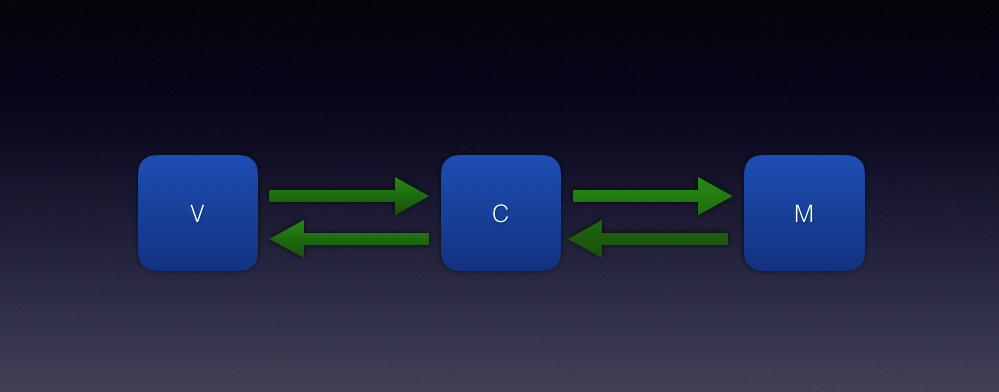

再后来有了MVP，MVP解决了UI逻辑和数据逻辑在一起的问题，同时也解决了Android代码测试困难问题。

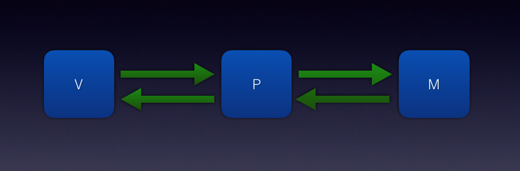

随着业务的增多，架构中有了Domain的概念，Domain从Data中获取数据，Data可能会是Net，File，Cache各种IO等，然后项目架构变成了这样。

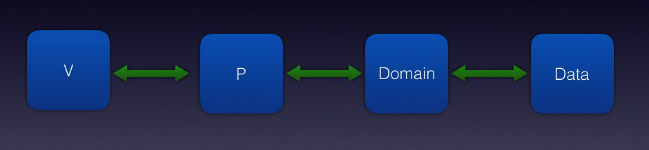

## 模块化介绍

MVP升级版用了一段时间以后，新问题又出现了。随着业务的增多，代码变的越来越复杂，每个模块之间的代码耦合变得越来越严重，解耦问题急需解决，同时编译时间也会越来越长。

开发人员增多，每个业务的组件各自实现一套，导致同一个App的UI风格不一样，技术实现也不一样，团队技术也无法得到沉淀，重复早轮子严重。

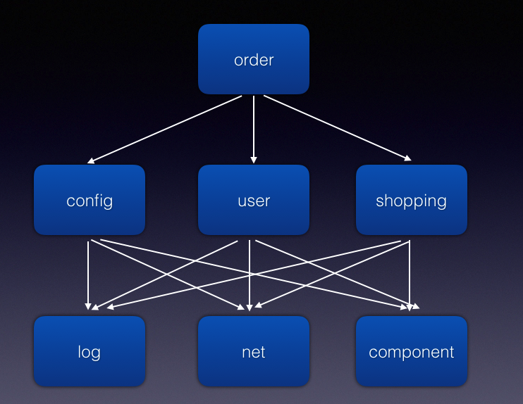

然后模块化（组件化）解决方案就出现了。

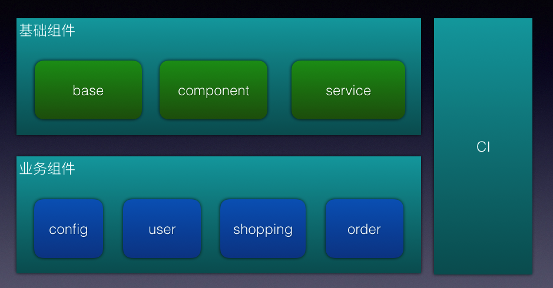

## 插件化介绍

讲道理，模块化已经是最终完美的解决方案了，为啥还需要插件化呢？

还是得从业务说起，如果一个公司有很多业务，并且每个业务可以汇总成一个大的App，又或者某一个小业务又需要单独做成一个小的App。

按照上面的说的模块化解决方案，需要把这个业务设计成一个模块，代码最终打包成一个aar，主App和业务App设计成一个运行壳子，编译打包时候使用Gradle做maven依赖即可。

举例说明美团和猫眼电影。

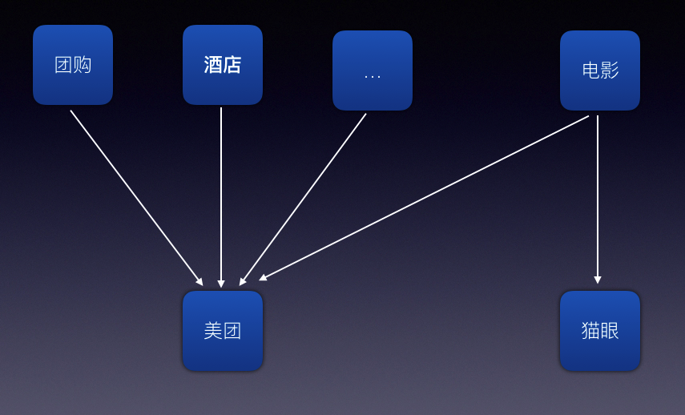

实际上这样做比较麻烦，主App和业务模块会或多或少依赖一点公共代码，如果公共代码出现变动，则需要对应做出修改。
同时业务代码会设计成Android Lib project，开发、编译、调试也有点麻烦，那么能不能这样设计，某个业务模块单独做出一个Apk，主App直接使用插件的方式，如果需要某种功能，那么直接加载某一个apk，而不是直接依赖代码的形式。

## 前提技术介绍

通过上面的业务演进，最终我们需要做的就是一个Apk调用另外一个Apk文件，这也就是我们今天的主题——插件化。

一个常识，大家都知道，Apk只有在安装的情况下，才可以被运行调用。如果一个Apk只是一个文件，放置在存储卡上，我们如何才能调用起来呢？

对于这个问题，先保留，后面会做讲解，当然了已经有几种方案是可以这样做的。但是为了了解插件化的原理，先回顾一下基础知识。

### APK构成

Apk是App代码最终编译打包生成的文件，主要包含代码（dex、so）、配置文件、资源问题、签名校验等。

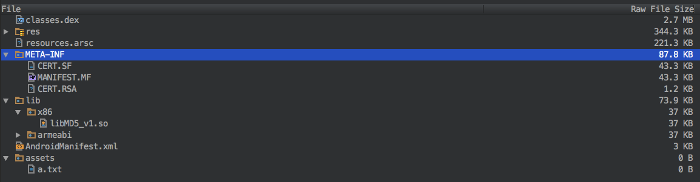

#### Manifest

App中系统组件配置文件，包括Application、Activity、Service、Receiver、Provider等。

App中所有可运行的Activity必须要在这里定义，否则就不能运行，也包括其他组件，Receiver也可以动态注册。（敲黑板，这里很重要，记住这句话。）

#### Application

App启动，代码中可以获取到被运行调用的第一个类，常用来做一些初始化操作。

#### 四大组件

四大系统组件Activity、Service、Receiver、Provider，代码中继承系统中的父类。如上面所说，必须要在manifest中配置定义，否则不可以被调用。

#### so

App中C、C++代码编译生成的二进制文件，与手机的CPU架构相关，不同CPU架构生成的文件有些不同。开发中常常会生成多份文件，然后打包到Apk中，不同CPU类型，会调用不同的文件。

#### resource

Android中资源文件比较多，通常放在res和assets文件夹下面。常见的有布局、图片、字符、样式、主题等。

#### 安装路径

上面的介绍的Apk结构，那么Apk安装以后，它的安装位置在哪，资源和数据又放在哪里呢？

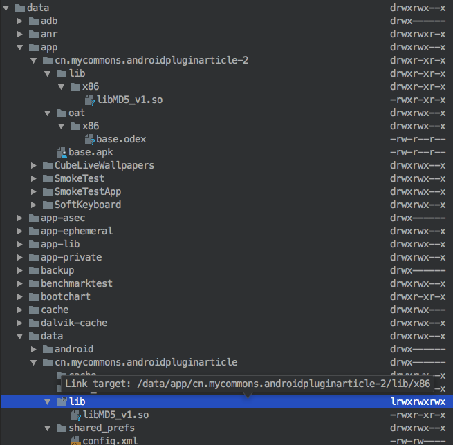

`/data/app/{package}/`主要放置Apk文件，同时Cpu对应的so文件也会被解压到对应的文件夹中，Android高级版本中还会对dex做优化，生成odex文件也在这个文件夹中。

`data/data/{package}/`主要存放App生成的数据，比如SharedPreferences、cache等其他文件。

那么问题来了，如果调用为安装的Apk，假设能够运行，那么他们的运行文件放在哪里？代码中生成的数据文件又要放在哪里？

### App启动流程介绍

App的二进制文件Apk安装以后，就可以直接启动了，直接点击Launcher上面的图片即可，但是我们需要的是一个App启动另外一个apk文件，所以有必要了解下App的启动流程。

#### IPC & Binder

在Android系统中，每一个应用程序都是由一些Activity和Service组成的，这些Activity和Service有可能运行在同一个进程中，也有可能运行在不同的进程中。那么，不在同一个进程的Activity或者Service是如何通信的呢？

Android系统提供一种Binder机制，能够使进程之间相互通信。

[Android进程间通信资料](http://blog.csdn.net/luoshengyang/article/details/6618363)


#### AMS

Activity启动流程说个一天也说不完，过程很长，也很繁琐，不过我们只要记住了AMS就可以了。

[Android系统应用框架篇：Activity启动流程](http://blog.csdn.net/AllenWells/article/details/68926952)

盗一张图

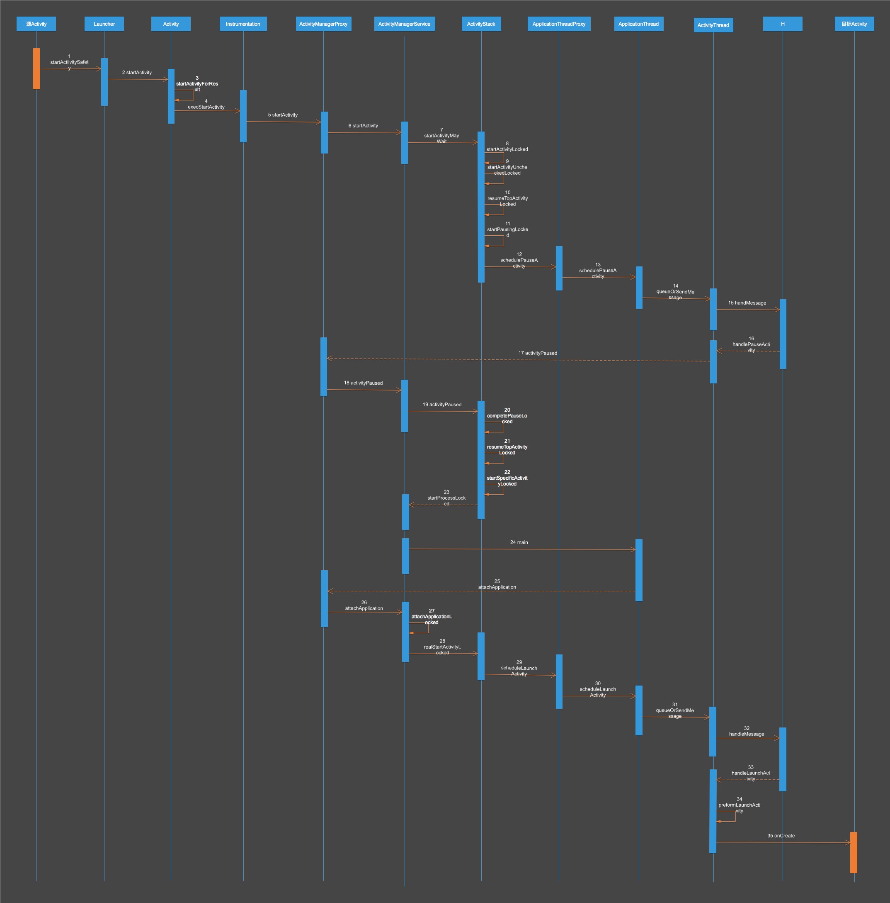

### 插件化技术问题与解决方案

#### 代码加载

按照正常思路，如果一个主Apk需要运行一个插件Apk，那么怎么样才能把里面的代码加载过来呢？

##### Java ClassLoader

Java中提供了ClassLoader方式来加载代码，然后就可以运行其中的代码了。这里有一份资料([深入分析Java ClassLoader原理](http://blog.csdn.net/xyang81/article/details/7292380)) ，可以简单了解下。

- 原理介绍

ClassLoader使用的是双亲委托模型来搜索类的，每个ClassLoader实例都有一个父类加载器的引用（不是继承的关系，是一个包含的关系），虚拟机内置的类加载器（Bootstrap ClassLoader）本身没有父类加载器，但可以用作其它ClassLoader实例的的父类加载器。
当一个ClassLoader实例需要加载某个类时，它会试图亲自搜索某个类之前，先把这个任务委托给它的父类加载器，这个过程是由上至下依次检查的，首先由最顶层的类加载器Bootstrap ClassLoader试图加载，
如果没加载到，则把任务转交给Extension ClassLoader试图加载，如果也没加载到，则转交给App ClassLoader 进行加载，如果它也没有加载得到的话，则返回给委托的发起者，由它到指定的文件系统或网络等URL中加载该类。
如果它们都没有加载到这个类时，则抛出ClassNotFoundException异常。否则将这个找到的类生成一个类的定义，并将它加载到内存当中，最后返回这个类在内存中的Class实例对象。

- 为什么要使用双亲委托这种模型呢？

因为这样可以避免重复加载，当父亲已经加载了该类的时候，就没有必要子ClassLoader再加载一次。
考虑到安全因素，我们试想一下，如果不使用这种委托模式，那我们就可以随时使用自定义的String来动态替代java核心api中定义的类型，这样会存在非常大的安全隐患，而双亲委托的方式，就可以避免这种情况，
因为String已经在启动时就被引导类加载器（Bootstrcp ClassLoader）加载，所以用户自定义的ClassLoader永远也无法加载一个自己写的String，除非你改变JDK中ClassLoader搜索类的默认算法。

- 但是JVM在搜索类的时候，又是如何判定两个class是相同的呢？

JVM在判定两个class是否相同时，不仅要判断两个类名是否相同，而且要判断是否由同一个类加载器实例加载的。
只有两者同时满足的情况下，JVM才认为这两个class是相同的。就算两个class是同一份class字节码，如果被两个不同的ClassLoader实例所加载，JVM也会认为它们是两个不同class。
比如网络上的一个Java类org.classloader.simple.NetClassLoaderSimple，javac编译之后生成字节码文件NetClassLoaderSimple.class，ClassLoaderA和ClassLoaderB这两个类加载器并读取了NetClassLoaderSimple.class文件，
并分别定义出了java.lang.Class实例来表示这个类，对于JVM来说，它们是两个不同的实例对象，但它们确实是同一份字节码文件，如果试图将这个Class实例生成具体的对象进行转换时，
就会抛运行时异常java.lang.ClassCaseException，提示这是两个不同的类型。

##### Android ClassLoader

Android 的 Dalvik/ART 虚拟机如同标准 Java 的 JVM 虚拟机一样，也是同样需要加载 class 文件到内存中来使用，但是在 ClassLoader 的加载细节上会有略微的差别。

[热修复入门：Android 中的 ClassLoader](http://jaeger.itscoder.com/android/2016/08/27/android-classloader.html)比较详细介绍了Android中ClassLoader。

在Android开发者官网上的[ClassLoader](https://developer.android.com/reference/java/lang/ClassLoader.html)的文档说明中我们可以看到，
ClassLoader是个抽象类，其具体实现的子类有 BaseDexClassLoader和SecureClassLoader。

SecureClassLoader的子类是URLClassLoader，其只能用来加载jar文件，这在Android的 Dalvik/ART 上没法使用的。

BaseDexClassLoader的子类是PathClassLoader和DexClassLoader 。

###### PathClassLoader

PathClassLoader 在应用启动时创建，从`/data/app/{package}`安装目录下加载 apk 文件。

有2个构造函数，如下所示，这里遵从之前提到的双亲委托模型：

```java
public PathClassLoader(String dexPath, ClassLoader parent) {
    super(dexPath, null, null, parent);
}

public PathClassLoader(String dexPath, String libraryPath, ClassLoader parent) {
    super(dexPath, null, libraryPath, parent);
}
```

- dexPath : 包含dex的jar文件或apk文件的路径集，多个以文件分隔符分隔，默认是“：”

- libraryPath : 包含 C/C++ 库的路径集，多个同样以文件分隔符分隔，可以为空

PathClassLoader 里面除了这2个构造方法以外就没有其他的代码了，具体的实现都是在 BaseDexClassLoader 里面，其dexPath比较受限制，一般是已经安装应用的 apk 文件路径。

在Android中，App安装到手机后，apk里面的class.dex中的class均是通过PathClassLoader来加载的。

###### DexClassLoader

介绍 DexClassLoader 之前，先来看看其官方描述：

> A class loader that loads classes from .jar and .apk filescontaining a classes.dex entry. This can be used to execute code notinstalled as part of an application.

很明显，对比 PathClassLoader 只能加载已经安装应用的dex或apk文件，DexClassLoader则没有此限制，可以从SD卡上加载包含class.dex的.jar和.apk 文件，这也是插件化和热修复的基础，在不需要安装应用的情况下，完成需要使用的dex的加载。

DexClassLoader 的源码里面只有一个构造方法，这里也是遵从双亲委托模型：

```java
public DexClassLoader(String dexPath, String optimizedDirectory, String libraryPath, ClassLoader parent) {
    super(dexPath, new File(optimizedDirectory), libraryPath, parent);
}
```

参数说明：

- String dexPath : 包含 class.dex 的 apk、jar 文件路径 ，多个用文件分隔符(默认是 ：)分隔

- String optimizedDirectory : 用来缓存优化的 dex 文件的路径，即从 apk 或 jar 文件中提取出来的 dex 文件。该路径不可以为空，且应该是应用私有的，有读写权限的路径（实际上也可以使用外部存储空间

- String libraryPath : 存储 C/C++ 库文件的路径集

- ClassLoader parent : 父类加载器，遵从双亲委托模型

#### 资源获取

我们知道，Android Apk里面除了代码，剩下的就是资源，而且资源占了很大一部分空间，我们可以利用ClassLoader来加载代码，那么如何来加载apk中的资源，而且Android中的资源种类又可以分为很多种，比如布局、图片，字符、样式、主题等。

在组件中获取资源时使用getResource获得Resource对象，通过这个对象我们可以访问相关资源，比如文本、图片、颜色等。

通过跟踪源码发现，其实getResource方法是Context的一个抽象方法，getResource的实现是在ContextImp中实现的。
获取的Resource对象是应用的全局变量，然后继续跟踪源码，发现 Resource中有一个AssetManager的全局变量，在Resource的构造函数中传入的，所以最终获取资源都是通过AssetManager获取的，于是我们把注意力放到AssetManager上。

我们要解决下面两个问题。

一、如何获取AssetManager对象。

二、如何通过AssetManager对象获取插件中apk的资源。

通过对AssetManager的相关源码跟踪，我们找到答案。

一、AssetManager的构造函数没有对api公开，不能使用new创建；context.getAssets()可用获取当前上下文环境的 AssetManager；利用反射 AssetManager.class.newInstance()这样可用获取对象。

二、如何获取插件apk中的资源。我们发现AssetManager中有个重要的方法。

```java
/**
 * Add an additional set of assets to the asset manager.  This can be
 * either a directory or ZIP file.  Not for use by applications.  Returns
 * the cookie of the added asset, or 0 on failure.
 * {@hide}
 */
public final int addAssetPath(String path) {
    return  addAssetPathInternal(path, false);
}
```

我们可以把一个包含资源的文件包添加到assets中。这就是AssetManager查找资源的第一个路径。这个方法是一个隐藏方法，我们可以通过反射调用。

```java
AssetManager assetManager = AssetManager.class.newInstance() ; // context .getAssets()？
AssetManager.class.getDeclaredMethod("addAssetPath", String.class).invoke(assetManager, apkPath);
Resources pluginResources = new Resources(assetManager, context.getResources().getDisplayMetrics(), context.getResources().getConfiguration());
```

#### Hook

Hook就是可以修改函数的调用，通常可以通过代理模式就可以达到修改的目的。

比如有个Java示例代码

```java
public interface IService {

    void fun();
}
public class ServiceImpl implements IService {

    private static final String TAG = "ServiceImpl";

    @Override
    public void fun() {
        Log.i(TAG, "fun: ");
    }
}
```

正常调用直接这样就可以了。

```java
public class MainActivity extends AppCompatActivity {

    private IService iService;

    @Override
    protected void onCreate(Bundle savedInstanceState) {
        super.onCreate(savedInstanceState);
        setContentView(R.layout.activity_main);

        iService = new ServiceImpl();
        callService();
    }

    void callService() {
        iService.fun();
    }
}
```

上面代码中MainActivity中含有iService字段，可以利用反射机制来替换它，然后当有其他地方调用iService的时候，就可以对调用方法进拦截和处理。

可以先实现自己的代理类，对需要Hook的地方添加下代码。

```java
public class ServiceProxy implements IService {

    private static final String TAG = "ServiceProxy";

    @NonNull
    private IService base;

    public ServiceProxy(@NonNull IService base) {
        this.base = base;
    }

    @Override
    public void fun() {
        Log.i(TAG, "fun: before");
        base.fun();
        Log.i(TAG, "fun: after");
    }
}
```

然后再修改MainActivity中的iService的值，首先获取iService字段的值，传给自己定义的Proxy对象，然后把Proxy对象再赋值给原先的iService字段，这样调用iService中方法的时候，就会执行Proxy的方法，然后由Proxy再进行处理。

```java
void reflectHock() {
    try {
        Class<? extends MainActivity> aClass = MainActivity.class;
        Field field = aClass.getDeclaredField("iService");
        field.setAccessible(true);
        IService service = (IService) field.get(this);
        IService proxy = new ServiceProxy(service);
        field.set(this, proxy);
    } catch (Exception e) {
        e.printStackTrace();
    }
}
```

当然有时候，实现自己的Proxy类是很麻烦的，可以利用Java的动态代理技术来搞定。

```java
public class MyInvocationHandler implements InvocationHandler {

    private static final String TAG = "MyInvocationHandler";

    @NonNull
    private IService service;

    public MyInvocationHandler(@NonNull IService service) {
        this.service = service;
    }

    @Override
    public Object invoke(Object o, Method method, Object[] objects) throws Throwable {
        Log.i(TAG, "invoke: before");
        Object result = method.invoke(service, objects);
        Log.i(TAG, "invoke: after");
        return result;
    }
}

void proxyHook() {
    try {
        Class<? extends MainActivity> aClass = MainActivity.class;
        Field field = aClass.getDeclaredField("iService");
        field.setAccessible(true);
        IService value = (IService) field.get(this);

        InvocationHandler handler = new MyInvocationHandler(value);
        ClassLoader classLoader = value.getClass().getClassLoader();
        Object instance = Proxy.newProxyInstance(classLoader, value.getClass().getInterfaces(), handler);

        field.set(this, instance);
    } catch (Exception e) {
        e.printStackTrace();
    }
}
```

## 主流框架方案

### Fragment加载

早在2012年时候，出现了一个简单的Android插件化方案，原理大致这样的。

我们知道Android基本的页面元素是Activity，如果要动态加载一个界面，那么需要动态加载加载一个Activity，但是Activity是需要注册在Manifest中的。

所以就把目标瞄向了Fragment，首先Fragment是不需要注册的，使用的时候直接new出一个对象即可，然后放到了Activity容器中即可，那么能否从一个apk钟加载出来一个FragmentClass，然后使用反射实例化，然后放入到Activity中呢？

答案是可以的，首先在Manifest中定义个容器HostContainerActivity，然后页面跳转的时候通过intent，把目标的页面的fragment的class写成路径，
当 HostContainerActivity 页面启动，从intent中获取Fragment的路径，然后利用反射，动态new出一个示例放入到布局中即可。

[AndroidDynamicLoader](https://github.com/mmin18/AndroidDynamicLoader)就是这样一个解决方案，但是这个方案是有限制的，所有的页面必须是Fragment，这样肯定不符合要求，所以这个方案就没有流行起来。

### Activity代理

上面说道了使用Fragment加载的形式，来显示插件中的页面，但是这个解决方案是有限制的，界面全部只能用Fragment，不能用Activity，不能称的上是一种完美的插件化解决方案。

那到底能不能用到Activity的方式，答案是肯定的。

可以这样，上面介绍了Fragment动态加载原理，我们把Fragment的路径换成Activity的路径，然后用原先的那个容器Activity，做为一个代理Activity，当HostContainerActivity启动时候，
初始化将要显示的Activity，然后当容器Activity依次执行对应的生命周期时候，容器Activity做一个代理Activity，也要相应执行动态加载的Activity。

大致代码示例如下：

```java
public class HostContainerActivity extends BaseActivity {

    public static final String EXTRA_BASE_ACTIVITY = "extra_base_activity";
    private BaseActivity remote;

    @Override
    public void onCreate(@Nullable Bundle savedInstanceState) {
        super.onCreate(savedInstanceState);

        String clazz = getIntent().getStringExtra(EXTRA_BASE_ACTIVITY);
        try {
            remote = (BaseActivity) Class.forName(clazz).newInstance();
            remote.onCreate(savedInstanceState);
        } catch (Exception e) {
            e.printStackTrace();
        }
    }

    @Override
    public void onStart() {
        super.onStart();

        remote.onStart();
    }

    @Override
    public void onResume() {
        super.onResume();

        remote.onResume();
    }

    @Override
    public void onPause() {
        super.onPause();

        remote.onPause();
    }

    @Override
    public void onStop() {
        super.onStop();

        remote.onStop();
    }

    @Override
    public void onDestroy() {
        super.onDestroy();

        remote.onDestroy();
    }
}
```

[dynamic-load-apk](https://github.com/singwhatiwanna/dynamic-load-apk)  这个动态化框架就是利用这个原理来实现的。

但是这个方案还是有限制的，因为插件中的Activity并不是系统直接运行的，而是由另外一个Activity作为代理运行的，这个Activity不是一个真正的Activity，
很多的功能是限制的，比如需要在Activity弹出一个Toast，则是不行的，因为当前的Activity没有context，所以dynamic-load-apk提出了1个关键字——that，
java中this表示对象本身，但是本对象不能当做context使用，因为当前的Activity只是一个Java对象，而that是真正运行的Activity对象。

### Activity占坑

上面介绍Activity代理的方法，虽然插件中可以正常使用Activity，但是限制还是很多，用起来很不方便。

那到底有没有最优解，既可以不需要注册Activity，又可以动态的加载Activity，答案是肯定的。我们可以来一个偷梁换柱，既然要注册咱们就先注册一个，然后启动的时候，
把需要的运行的Activity当做参数传递过去，让系统启动那个替身Activity，当时机恰当的时候，我们再把那个Activity的对象给换回来即可，这个叫做瞒天过海。

这里有一篇[文章](http://weishu.me/2016/03/21/understand-plugin-framework-activity-management/)详细记载了Activity占坑方案是怎么运行的以及方案的原理。

## 360RePlugin介绍

Ok，上面说了这么多，全部都是引子，下面着重介绍今天的主角——RePlugin。

RePlugin是一套完整的、稳定的、适合全面使用的，占坑类插件化方案，由360手机卫士的RePlugin Team研发，也是业内首个提出”全面插件化“（全面特性、全面兼容、全面使用）的方案。

### 主要优势

- 极其灵活：

主程序无需升级（无需在Manifest中预埋组件），即可支持新增的四大组件，甚至全新的插件

- 非常稳定：

Hook点仅有一处（ClassLoader），无任何Binder Hook！如此可做到其崩溃率仅为“万分之一”，并完美兼容市面上近乎所有的Android ROM

- 特性丰富：

支持近乎所有在“单品”开发时的特性。包括静态Receiver、Task-Affinity坑位、自定义Theme、进程坑位、AppCompat、DataBinding等

- 易于集成：

无论插件还是主程序，只需“数行”就能完成接入

- 管理成熟：

拥有成熟稳定的“插件管理方案”，支持插件安装、升级、卸载、版本管理，甚至包括进程通讯、协议版本、安全校验等

- 数亿支撑：

有360手机卫士庞大的数亿用户做支撑，三年多的残酷验证，确保App用到的方案是最稳定、最适合使用的

### 集成与Demo演示

集成也非常简单，比如有2个工程，一个是主工程host，一个是插件工程sub。

本人写作的时候，RePlugin版本为`2.1.5`，可能会与最新版本不一致。

- 添加Host根目录Gradle依赖

```gradle
buildscript {
    repositories {
        jcenter()
    }
    dependencies {
        classpath 'com.android.tools.build:gradle:2.3.3'

        // NOTE: Do not place your application dependencies here; they belong
        // in the individual module build.gradle files
        classpath 'com.qihoo360.replugin:replugin-host-gradle:2.1.5'
    }
}
```

- 添加Host项目Gradle依赖

```gradle
apply plugin: 'com.android.application'
apply plugin: 'replugin-host-gradle'

android {
    compileSdkVersion 26
    buildToolsVersion "26.0.0"
    defaultConfig {
        applicationId "cn.mycommons.replugindemo"
        minSdkVersion 15
        targetSdkVersion 26
        versionCode 1
        versionName "1.0"
        testInstrumentationRunner "android.support.test.runner.AndroidJUnitRunner"
    }
    buildTypes {
        release {
            minifyEnabled false
            proguardFiles getDefaultProguardFile('proguard-android.txt'), 'proguard-rules.pro'
        }
    }
}

repluginHostConfig {
    useAppCompat = true
}

dependencies {
    compile fileTree(dir: 'libs', include: ['*.jar'])
    compile 'com.android.support:appcompat-v7:26.+'
    compile 'com.android.support.constraint:constraint-layout:1.0.2'
    compile 'com.qihoo360.replugin:replugin-host-lib:2.1.5'

    testCompile 'junit:junit:4.12'
    androidTestCompile('com.android.support.test.espresso:espresso-core:2.2.2', {
        exclude group: 'com.android.support', module: 'support-annotations'
    })
}
```

- 添加Sub根目录Gradle依赖

```gradle
buildscript {
    repositories {
        jcenter()
    }
    dependencies {
        classpath 'com.android.tools.build:gradle:2.3.3'

        // NOTE: Do not place your application dependencies here; they belong
        // in the individual module build.gradle files
        classpath 'com.qihoo360.replugin:replugin-plugin-gradle:2.1.5'
    }
}
```

- 添加Sub项目Gradle依赖

```gradle
apply plugin: 'com.android.application'
apply plugin: 'replugin-plugin-gradle'

android {
    compileSdkVersion 26
    buildToolsVersion "26.0.0"

    defaultConfig {
        applicationId "cn.mycommons.repluginsdemo.sub"
        minSdkVersion 15
        targetSdkVersion 26
        versionCode 1
        versionName "1.0"

        testInstrumentationRunner "android.support.test.runner.AndroidJUnitRunner"

    }
    buildTypes {
        release {
            minifyEnabled false
            proguardFiles getDefaultProguardFile('proguard-android.txt'), 'proguard-rules.pro'
        }
    }
}

repluginPluginConfig {
    //插件名
    pluginName = "app"
    //宿主app的包名
    hostApplicationId = "cn.mycommons.replugindemo"
    //宿主app的启动activity
    hostAppLauncherActivity = "cn.mycommons.replugindemo.MainActivity"

    // Name of 'App Module'，use '' if root dir is 'App Module'. ':app' as default.
    appModule = ':app'

    // Injectors ignored
    // LoaderActivityInjector: Replace Activity to LoaderActivity
    // ProviderInjector: Inject provider method call.
    // ignoredInjectors = ['LoaderActivityInjector']
}

dependencies {
    compile fileTree(dir: 'libs', include: ['*.jar'])

    compile 'com.android.support:appcompat-v7:26.+'
    compile 'com.android.support.constraint:constraint-layout:1.0.2'
    compile 'com.qihoo360.replugin:replugin-plugin-lib:2.1.5'

    testCompile 'junit:junit:4.12'
    androidTestCompile('com.android.support.test.espresso:espresso-core:2.2.2', {
        exclude group: 'com.android.support', module: 'support-annotations'
    })
}
```

### 原理介绍

RePlugin源码主要分为4部分，对比其他插件化，它的强大和特色，在于它只Hook住了ClassLoader。One Hook这个坚持，最大程度保证了稳定性、兼容性和可维护性。

#### host lib

插件宿主库，主要是对插件的管理，以及对ClassLoader的Hook，具体原理和管理逻辑不做详细解释。

#### host gradle

对插件宿主代码编译过程进行处理，主要有config.json文件生成、RePluginHostConfig.java代码生成、以及Activity坑位代码插入到Manifest中。

比如我们内置一个插件，按照官方文档，这样操作的。

- 将APK改名为：\[插件名\].jar

- 放入主程序的assets/plugins目录

我们可以看看Host apk中包含哪些资源。

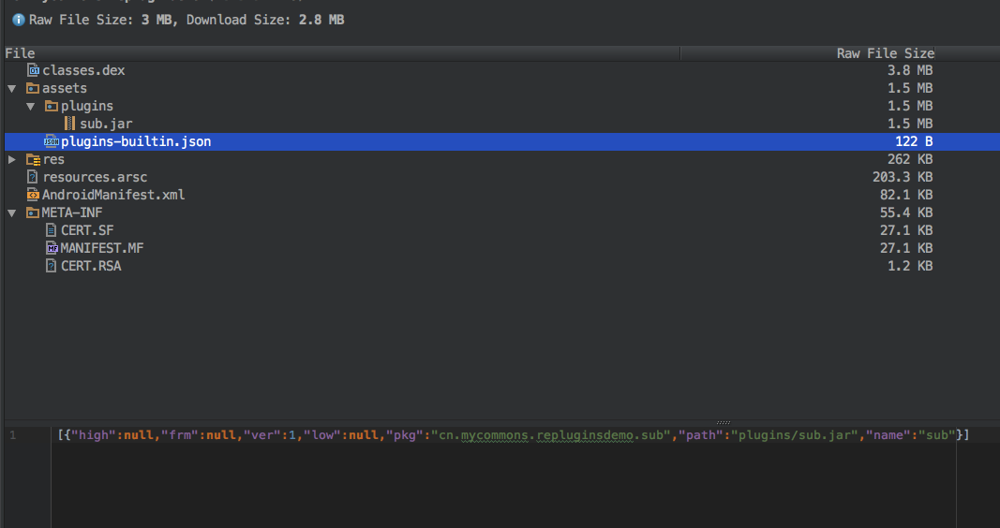

插件自动生成了plugin-builtin.json文件

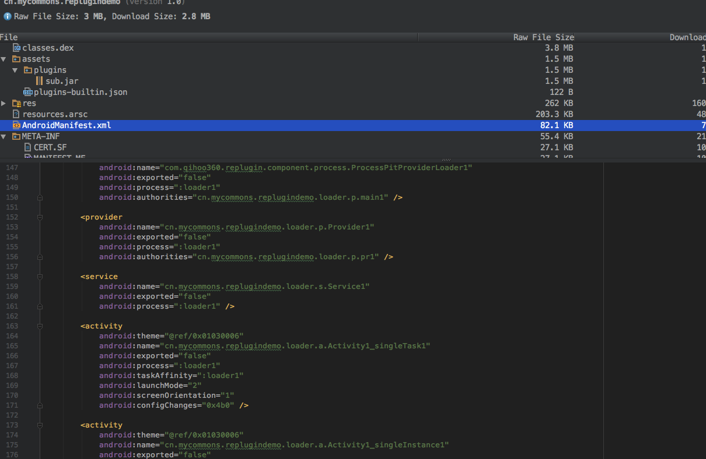

同时也在Manifest中插入很多坑位。

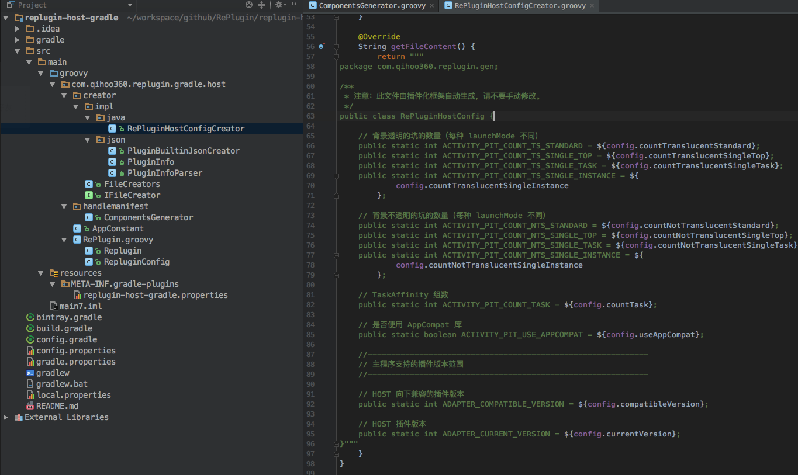

RePluginHostConfig.java代码生成逻辑。

#### plugin lib

同宿主库一样，这个是给插件App提供基本的支持。

#### plugin gradle

对插件App代码编译过程进行处理，主要修改插件中四大组建的父类，没错，就是这样。

比如有个`LoginActivity`，它是继承`Activity`的，那么会修改它的父类为`PluginActivity`，如果是`AppCompatActivity`，那么会替换成`PluginAppCompatActivity`

如：

```java
public class MainActivity extends AppCompatActivity {

    @Override
    protected void onCreate(Bundle savedInstanceState) {
        super.onCreate(savedInstanceState);

        setContentView(R.layout.activity_main);
    }
}
```

反编译Apk可以看到修改后的结果。

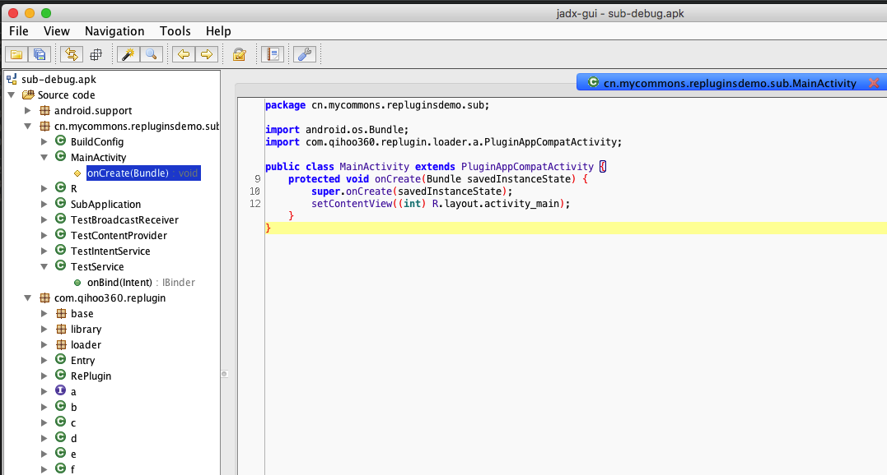

源码里面也有体现

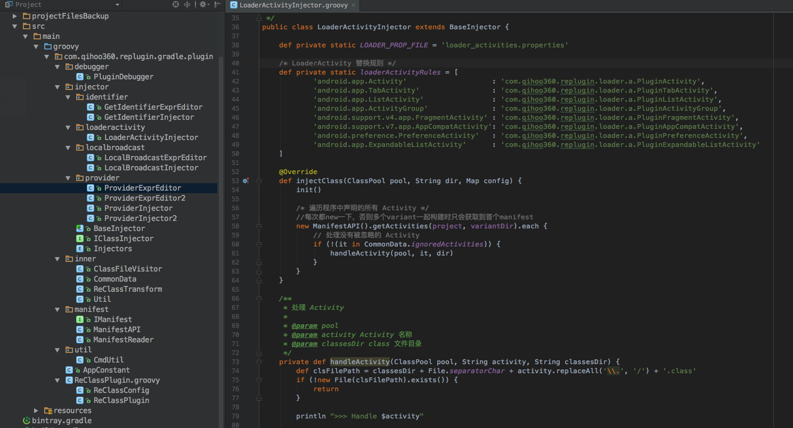

## 其他插件化方案

上次大致是RePlugin的原理，当然除了RePlugin的解决方案以外，还有其他几家厂商的解决方案。

### Instant App

[Android Instant App 官网](https://developer.android.com/topic/instant-apps/index.html)

16年IO的时候，Google提出了Instant App特性，在17年IO正式发布这项技术，不过这项技术在我写这篇文章的时候，还是beta版本。

它的使用方式很简单，你在 Android 手机上，朋友给你发来一个链接，比方说一家外卖店面。而恰好外卖App应用也支持了 Instant Apps。你点击了这个链接，就直接进入了外卖应用，即便手机并没有安装它。

实现原理大致是利用App linker唤起打开app的intent，Google Play检测到支持该intent,而且没有安装后，直接通过类似Android插件化的原理，打开相关页面。

但是这个Instant App必须发布在Google Play上， 国内暂时没有办法使用。

### 淘宝Atlas

[淘宝Atlas](https://github.com/alibaba/atlas)

Atlas是伴随着手机淘宝的不断发展而衍生出来的一个运行于Android系统上的一个容器化框架，我们也叫动态组件化(Dynamic Bundle)框架。它主要提供了解耦化、组件化、动态性的支持。覆盖了工程师的工程编码期、Apk运行期以及后续运维期的各种问题。

在工程期，实现工程独立开发，调试的功能，工程模块可以独立。

在运行期，实现完整的组件生命周期的映射，类隔离等机制。

在运维期，提供快速增量的更新修复能力，快速升级。

Atlas是工程期和运行期共同起作用的框架，我们尽量将一些工作放到工程期，这样保证运行期更简单，更稳定。

相比multidex，atlas在解决了方法数限制的同时以OSGI为参考，明确了业务开发的边界，使得业务在满足并行迭代，快速开发的同时，能够进行灵活发布，动态更新以及提供了线上故障快速修复的能力。

与外界某些插件框架不同的是，atlas是一个组件框架，atlas不是一个多进程的框架，他主要完成的就是在运行环境中按需地去完成各个bundle的安装，加载类和资源。

### 滴滴VirtualAPK

[VirtualAPK](https://github.com/didi/VirtualAPK)

[VirtualAPK介绍](http://geek.csdn.net/news/detail/130917)

VirtualAPK是滴滴17年开源出来的一款插件化方案。

### Small

[Small](https://github.com/wequick/Small)

> 世界那么大，组件那么小。Small，做最轻巧的跨平台插件化框架。 ——Galenlin

这是Small作者，林光亮老师，给Small一句概括。

## 总结

本文只是简单的介绍下插件化相关内容，很多内容也是参照大神的博客的，感觉80%都是从别人那边复制过来的，同时插件不只是简单的加载界面和资源，包括BroadCastReceiver、Service等组件使用。

RePlugin使用方法还是蛮简单的，大部分情况下，插件的开发，相当于单独的一个App开发。

相对于其他厂商的方案，个人比较偏向于RePlugin，主要是因为开发简单，比较稳定，Hook点少，支持特性较多等。

## 相关资料

[关于Android模块化我有一些话不知当讲不当讲](https://github.com/LiushuiXiaoxia/AndroidModular)

[Android插件化原理解析——Hook机制之动态代理](http://weishu.me/2016/01/28/understand-plugin-framework-proxy-hook/)

[APK文件结构和安装过程](http://blog.csdn.net/bupt073114/article/details/42298337)

[Android进程间通信资料](http://blog.csdn.net/luoshengyang/article/details/6618363)

[Android系统应用框架篇：Activity启动流程](http://blog.csdn.net/AllenWells/article/details/68926952)

[Android 插件化原理解析——Hook机制之AMS&PMS](http://weishu.me/2016/03/07/understand-plugin-framework-ams-pms-hook/)

[深入分析Java ClassLoader原理](http://blog.csdn.net/xyang81/article/details/7292380)

[热修复入门：Android中的ClassLoader](http://jaeger.itscoder.com/android/2016/08/27/android-classloader.html)

[ANDROID应用程序插件化研究之ASSETMANAGER](http://www.liuguangli.win/archives/370)

[DroidPlugin](https://github.com/Qihoo360/DroidPlugin)

[DynamicAPK](https://github.com/CtripMobile/DynamicAPK)

[AndroidDynamicLoader，利用动态加载Fragment来解决](https://github.com/mmin18/AndroidDynamicLoader)

[dynamic-load-apk](https://github.com/singwhatiwanna/dynamic-load-apk)

[android-pluginmgr](https://github.com/houkx/android-pluginmgr)

[Small](https://github.com/wequick/Small)

[DynamicAPK](https://github.com/CtripMobile/DynamicAPK)

[淘宝Atlas](https://github.com/alibaba/atlas)

[VirtualAPK](https://github.com/didi/VirtualAPK)

[VirtualAPK介绍](http://geek.csdn.net/news/detail/130917)

[Android Instant App 官网](https://developer.android.com/topic/instant-apps/index.html)